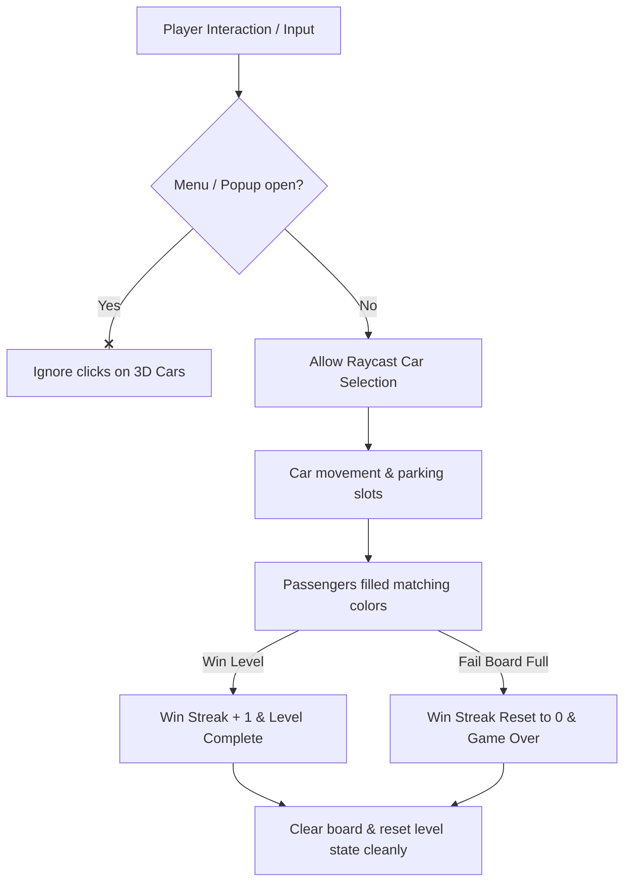

# Implementation Plan - Car Jam Juice, Ads, Haptics & Bug Fixes

This document outlines the complete plan for enhancing the game feel, adding the AdMob system, integrating the win streak tracker, and patching critical bugs (such as clicking through UI and memory leaks). 

> [!IMPORTANT]
> As requested, **no files will be modified yet**. This document serves as a complete blueprint showing exactly what will be changed and where.

---

## 1. Summary of Planned Enhancements

We will implement five main features:
1. **All-in-One UI Juice Script (`UIJuiceEffects.cs`)**: A single script handles continuous rotation (rewards light), button pulsing, floating hover, button shine sweeping, and gold coin spawning/flying animations.
2. **Input Click-Through Block**: Prevent clicking/selecting cars on the board while the Main Menu or any UI popup is open.
3. **Win Streak System**: Tracks consecutive wins. Increments on level complete, resets to 0 on game over (loss).
4. **Google AdMob Manager & Button Helper**: A simple singleton to load and play Interstitial and Rewarded ads, complete with fallback mock mode for testing in the Unity Editor.
5. **Juice Integration & Haptics**: Activate the pre-existing `HapticManager` calls for tactile feedback on car select, crashes, passenger boarding, and wins.

---

## 2. Bug Identifications & Fixes

We identified 4 critical bugs in the codebase that can cause soft-locks, memory leaks, or poor performance:

### Bug A: Click-Through to 3D Game View
* **Issue**: Clicking empty spaces when popups (Settings, shop, daily reward) are open raycasts into the 3D board, selecting/moving cars. `Time.timeScale = 0` does not disable mouse raycasts in `Update()`.
* **Fix**: Modify `CarController.cs` to check if the screen is `GameView` and no popup is active before executing selection.

### Bug B: Missing Level Cleanup (Visual Clipping & Memory Leak)
* **Issue**: When a level is completed, `CompleteLevel()` loads the next level but never pools the remaining cars from the grid. This causes cars to pile up and clip in the scene.
* **Fix**: Refactor `LevelManager.cs` to run a unified `ClearCurrentLevelData()` routine during both level completion and level restarts.

### Bug C: Soft-Lock on "Fill First Slot" Power-Up
* **Issue**: When using the power-up to clear the final passengers, the waitlist reaches 0. However, `CheckWinCondition()` is only called in the passenger movement queue coroutine (which is inactive), causing the game to sit indefinitely without showing the win popup.
* **Fix**: Call `CheckWinCondition()` at the end of the power-up fill routine.

### Bug D: DOTween Leaks & double loop issues
* **Issue**: Pooled game objects are deactivated while active DOTween sequences are running on them, causing errors.
* **Fix**: Add `DOKill()` to `OnDisable()` in `CarMover` and `Carout`. Clean up the double-increment loop in `CarMover.MoveRoutine()`.

---

## 3. Proposed Changes

### Component 1: New Feature Scripts

#### [NEW] [UIJuiceEffects.cs](file:///c:/Users/ABHAYprajapati/Downloads/Car-OUT-jam-puzzle-Game-Grid/Car-OUT-jam-puzzle-Game-Grid/Assets/Script/AnimationScript/UIJuiceEffects.cs)
Create a single, all-in-one UI animation controller.
```csharp
using System.Collections;
using System.Collections.Generic;
using UnityEngine;
using UnityEngine.UI;
using DG.Tweening;

public class UIJuiceEffects : MonoBehaviour
{
    public enum EffectType
    {
        ContinuousRotate,  // For reward background glow/light
        ButtonShine,       // Sweeping shine effect
        Pulse,             // Button heartbeat scale pulse
        Float,             // Floating up and down
        None
    }

    [Header("General Settings")]
    public EffectType activeEffect = EffectType.None;
    public bool playOnStart = true;

    [Header("Rotate Settings")]
    public float rotationSpeed = 30f;

    [Header("Pulse Settings")]
    public float pulseSpeed = 1f;
    public float pulseScale = 1.1f;

    [Header("Float Settings")]
    public float floatSpeed = 1f;
    public float floatAmount = 10f;

    [Header("Button Shine Settings")]
    public Image shineImage; // Child image representing the shine overlay
    public float shineDuration = 1.5f;
    public float shineCooldown = 2f;

    [Header("Coin Flying Settings")]
    public GameObject coinPrefab;
    public Transform targetCoinCounter; 
    public int coinCount = 10;
    public float coinSpread = 100f;
    public float flyDuration = 0.8f;
    
    private Tween activeTween;
    private Coroutine activeCoroutine;
    private Vector3 originalScale;
    private Vector2 originalAnchoredPosition;
    private RectTransform rectTransform;

    void Awake()
    {
        rectTransform = GetComponent<RectTransform>();
        originalScale = transform.localScale;
        if (rectTransform != null)
        {
            originalAnchoredPosition = rectTransform.anchoredPosition;
        }
    }

    void Start()
    {
        if (playOnStart)
        {
            PlayEffect();
        }
    }

    public void PlayEffect()
    {
        StopEffect();

        switch (activeEffect)
        {
            case EffectType.ContinuousRotate:
                activeTween = transform.DORotate(new Vector3(0, 0, 360), 360f / rotationSpeed, RotateMode.FastBeyond360)
                    .SetEase(Ease.Linear)
                    .SetLoops(-1, LoopType.Incremental);
                break;

            case EffectType.Pulse:
                activeTween = transform.DOScale(originalScale * pulseScale, pulseSpeed)
                    .SetEase(Ease.InOutSine)
                    .SetLoops(-1, LoopType.Yoyo);
                break;

            case EffectType.Float:
                if (rectTransform != null)
                {
                    activeTween = rectTransform.DOAnchorPosY(originalAnchoredPosition.y + floatAmount, floatSpeed)
                        .SetEase(Ease.InOutSine)
                        .SetLoops(-1, LoopType.Yoyo);
                }
                break;

            case EffectType.ButtonShine:
                if (shineImage != null)
                {
                    activeCoroutine = StartCoroutine(ButtonShineRoutine());
                }
                break;
        }
    }

    public void StopEffect()
    {
        if (activeTween != null)
        {
            activeTween.Kill();
            activeTween = null;
        }
        if (activeCoroutine != null)
        {
            StopCoroutine(activeCoroutine);
            activeCoroutine = null;
        }

        transform.localScale = originalScale;
        if (rectTransform != null)
        {
            rectTransform.anchoredPosition = originalAnchoredPosition;
        }
        if (shineImage != null)
        {
            shineImage.gameObject.SetActive(false);
        }
    }

    private IEnumerator ButtonShineRoutine()
    {
        RectTransform shineRect = shineImage.GetComponent<RectTransform>();
        if (shineRect == null) yield break;

        while (true)
        {
            shineImage.gameObject.SetActive(true);
            shineRect.anchoredPosition = new Vector2(-rectTransform.rect.width, 0);

            shineRect.DOAnchorPosX(rectTransform.rect.width, shineDuration)
                .SetEase(Ease.InOutQuad);

            yield return new WaitForSeconds(shineDuration);
            shineImage.gameObject.SetActive(false);
            yield return new WaitForSeconds(shineCooldown);
        }
    }

    /// <summary>
    /// Spawns coin UI elements and flies them to the target coin counter
    /// </summary>
    public void FlyCoins(System.Action onFinishedAll = null)
    {
        if (coinPrefab == null || targetCoinCounter == null)
        {
            Debug.LogError("FlyCoins requires coinPrefab and targetCoinCounter assigned!");
            return;
        }

        Vector3 startPos = transform.position;

        for (int i = 0; i < coinCount; i++)
        {
            GameObject coin = Instantiate(coinPrefab, transform.parent);
            coin.transform.position = startPos;
            
            RectTransform coinRect = coin.GetComponent<RectTransform>();
            if (coinRect != null)
            {
                Vector2 randomOffset = Random.insideUnitCircle * coinSpread;
                Vector3 midPoint = startPos + new Vector3(randomOffset.x, randomOffset.y, 0);

                coin.transform.localScale = Vector3.zero;
                
                Sequence seq = DOTween.Sequence();
                seq.Append(coin.transform.DOScale(1.2f, 0.2f).SetEase(Ease.OutBack));
                seq.Join(coin.transform.DOMove(midPoint, 0.2f).SetEase(Ease.OutQuad));
                seq.AppendInterval(0.05f + (i * 0.03f));
                seq.Append(coin.transform.DOMove(targetCoinCounter.position, flyDuration).SetEase(Ease.InBack));
                seq.Join(coin.transform.DOScale(0.5f, flyDuration));
                
                int index = i;
                seq.OnComplete(() =>
                {
                    targetCoinCounter.DOPunchScale(new Vector3(0.15f, 0.15f, 0.15f), 0.15f, 5, 0.5f);
                    
                    if (SoundManager.Instance != null)
                    {
                        SoundManager.Instance.PlaySound(SoundManager.SoundName.PassengerAdd);
                    }
                    
                    Destroy(coin);

                    if (index == coinCount - 1)
                    {
                        onFinishedAll?.Invoke();
                    }
                });
            }
            else
            {
                Destroy(coin);
            }
        }
    }
}
```

---

#### [NEW] [AdMobManager.cs](file:///c:/Users/ABHAYprajapati/Downloads/Car-OUT-jam-puzzle-Game-Grid/Car-OUT-jam-puzzle-Game-Grid/Assets/Script/AdditionalFeatures/AdMobManager.cs)
A robust singleton manager. Wrapped in preprocessors so it runs in Mock Mode by default, avoiding compilation failures if the AdMob package isn't imported yet.
```csharp
using System;
using UnityEngine;
#if USE_ADMOB
using GoogleMobileAds.Api;
#endif

public class AdMobManager : MonoBehaviour
{
    public static AdMobManager Instance;

    [Header("Ad Unit IDs (Test IDs by default)")]
    public string androidInterstitialId = "ca-app-pub-3940256099942544/1033173712";
    public string iosInterstitialId = "ca-app-pub-3940256099942544/4411468910";
    
    public string androidRewardedId = "ca-app-pub-3940256099942544/5224354917";
    public string iosRewardedId = "ca-app-pub-3940256099942544/1712485313";

    public bool useTestAds = true;

#if USE_ADMOB
    private InterstitialAd interstitialAd;
    private RewardedAd rewardedAd;
#endif

    private Action onRewardedAdCompleted;

    void Awake()
    {
        if (Instance == null)
        {
            Instance = this;
            DontDestroyOnLoad(gameObject);
        }
        else
        {
            Destroy(gameObject);
            return;
        }

        InitializeAds();
    }

    private void InitializeAds()
    {
#if USE_ADMOB
        MobileAds.Initialize((InitializationStatus initStatus) =>
        {
            Debug.Log("AdMob Initialized.");
            LoadInterstitialAd();
            LoadRewardedAd();
        });
#else
        Debug.Log("AdMob Mock Mode active. Define 'USE_ADMOB' in player settings to enable real Google Mobile Ads SDK.");
#endif
    }

    public void LoadInterstitialAd()
    {
#if USE_ADMOB
        string adUnitId = GetInterstitialAdUnitId();
        if (interstitialAd != null)
        {
            interstitialAd.Destroy();
            interstitialAd = null;
        }

        var adRequest = new AdRequest();
        InterstitialAd.Load(adUnitId, adRequest, (InterstitialAd ad, LoadAdError error) =>
        {
            if (error != null || ad == null) return;
            interstitialAd = ad;
            RegisterInterstitialEvents(interstitialAd);
        });
#endif
    }

    public void ShowInterstitialAd()
    {
#if USE_ADMOB
        if (interstitialAd != null && interstitialAd.CanShowAd())
        {
            interstitialAd.Show();
        }
        else
        {
            LoadInterstitialAd();
        }
#else
        Debug.Log("[Mock Ad] Showing Interstitial Ad.");
#endif
    }

#if USE_ADMOB
    private void RegisterInterstitialEvents(InterstitialAd ad)
    {
        ad.OnAdFullScreenContentClosed += () => LoadInterstitialAd();
        ad.OnAdFullScreenContentFailed += (AdError error) => LoadInterstitialAd();
    }
#endif

    public void LoadRewardedAd()
    {
#if USE_ADMOB
        string adUnitId = GetRewardedAdUnitId();
        if (rewardedAd != null)
        {
            rewardedAd.Destroy();
            rewardedAd = null;
        }

        var adRequest = new AdRequest();
        RewardedAd.Load(adUnitId, adRequest, (RewardedAd ad, LoadAdError error) =>
        {
            if (error != null || ad == null) return;
            rewardedAd = ad;
            RegisterRewardedEvents(rewardedAd);
        });
#endif
    }

    public void ShowRewardedAd(Action onSuccess)
    {
        onRewardedAdCompleted = onSuccess;

#if USE_ADMOB
        if (rewardedAd != null && rewardedAd.CanShowAd())
        {
            rewardedAd.Show((Reward reward) =>
            {
                onRewardedAdCompleted?.Invoke();
                onRewardedAdCompleted = null;
            });
        }
        else
        {
            LoadRewardedAd();
            onSuccess?.Invoke(); // Fallback reward in development
        }
#else
        Debug.Log("[Mock Ad] Showing Rewarded Ad. Rewarding user...");
        onSuccess?.Invoke();
#endif
    }

#if USE_ADMOB
    private void RegisterRewardedEvents(RewardedAd ad)
    {
        ad.OnAdFullScreenContentClosed += () => LoadRewardedAd();
        ad.OnAdFullScreenContentFailed += (AdError error) => LoadRewardedAd();
    }
#endif

    private string GetInterstitialAdUnitId()
    {
        if (useTestAds)
        {
#if UNITY_ANDROID
            return "ca-app-pub-3940256099942544/1033173712";
#elif UNITY_IOS
            return "ca-app-pub-3940256099942544/4411468910";
#else
            return "unused";
#endif
        }
#if UNITY_ANDROID
        return androidInterstitialId;
#elif UNITY_IOS
        return iosInterstitialId;
#else
        return "unused";
#endif
    }

    private string GetRewardedAdUnitId()
    {
        if (useTestAds)
        {
#if UNITY_ANDROID
            return "ca-app-pub-3940256099942544/5224354917";
#elif UNITY_IOS
            return "ca-app-pub-3940256099942544/1712485313";
#else
            return "unused";
#endif
        }
#if UNITY_ANDROID
        return androidRewardedId;
#elif UNITY_IOS
        return iosRewardedId;
#else
        return "unused";
#endif
    }
}
```

---

#### [NEW] [AdMobButtonHelper.cs](file:///c:/Users/ABHAYprajapati/Downloads/Car-OUT-jam-puzzle-Game-Grid/Car-OUT-jam-puzzle-Game-Grid/Assets/Script/AdditionalFeatures/AdMobButtonHelper.cs)
An easy component to drop on buttons.
```csharp
using UnityEngine;
using UnityEngine.UI;

[RequireComponent(typeof(Button))]
public class AdMobButtonHelper : MonoBehaviour
{
    public enum AdType { Interstitial, Rewarded }
    public AdType adType = AdType.Rewarded;
    public int coinReward = 100;

    private Button button;

    void Start()
    {
        button = GetComponent<Button>();
        button.onClick.AddListener(OnButtonClick);
    }

    private void OnButtonClick()
    {
        if (AdMobManager.Instance == null) return;

        if (adType == AdType.Interstitial)
        {
            AdMobManager.Instance.ShowInterstitialAd();
        }
        else if (adType == AdType.Rewarded)
        {
            AdMobManager.Instance.ShowRewardedAd(() =>
            {
                if (SaveData.Instance != null)
                {
                    SaveData.Instance.AddCurrency(coinReward);
                }
                
                UIJuiceEffects juice = GetComponent<UIJuiceEffects>() ?? FindObjectOfType<UIJuiceEffects>();
                if (juice != null) juice.FlyCoins();
            });
        }
    }
}
```

---

### Component 2: Existing File Replacements

#### [MODIFY] [SaveData.cs](file:///c:/Users/ABHAYprajapati/Downloads/Car-OUT-jam-puzzle-Game-Grid/Car-OUT-jam-puzzle-Game-Grid/Assets/Script/SaveData/SaveData.cs)
We will add `winStreak` to the player data container so progress is saved across sessions.

```diff
<<<<
 public class GameSaveData
 {
     public string playerName = "Player";
 
     public int currentLevel = 1;
 
     public int currency = 0;
====
 public class GameSaveData
 {
     public string playerName = "Player";
 
     public int currentLevel = 1;
 
     public int currency = 0;
+
+    public int winStreak = 0;
>>>>
```

---

#### [MODIFY] [LevelManager.cs](file:///c:/Users/ABHAYprajapati/Downloads/Car-OUT-jam-puzzle-Game-Grid/Car-OUT-jam-puzzle-Game-Grid/Assets/Script/Level/LevelManager.cs)
We will integrate:
1. Streak increments on completing levels.
2. A unified cleanup method `ClearCurrentLevelData()` which is called whenever a level completes or restarts, preventing visual car-stacking.

```diff
<<<<
     public void CompleteLevel()
     {
         currentLevelIndex++;
 
         SaveData.Instance.SetLevel(currentLevelIndex + 1);
 
         Debug.Log("SAVED LEVEL: " + (currentLevelIndex + 1));
         SaveData.Instance.Save();
 
         LoadLevel();
     }
 
     #region ResetLevel
     public void RestartLevel()
     {
         SoundManager.Instance.StopHelicopterSound();
         ResetPowerUpFullState();
         // 1. Clear Cars (Loop backwards to avoid IndexOutOfRange)
         if (spawnPassengers.TotalCarsSpawn != null)
         {
             for (int i = spawnPassengers.TotalCarsSpawn.Count - 1; i >= 0; i--)
             {
                 CarMover car = spawnPassengers.TotalCarsSpawn[i];
                 if (car != null)
                 {
                     ObjectPool.Instance.AddToPool(car.gameObject);
                 }
             }
             spawnPassengers.TotalCarsSpawn.Clear();
         }
 
         // 2. Clear Waiting Passengers
         if (parkingGameManager.waitingPassengers != null)
         {
             for (int i = parkingGameManager.waitingPassengers.Count - 1; i >= 0; i--)
             {
                 Passenger p = parkingGameManager.waitingPassengers[i];
                 if (p != null)
                 {
                     ObjectPool.Instance.AddToPool(p.gameObject);
                 }
             }
             parkingGameManager.waitingPassengers.Clear();
         }
 
         // 3. Reset Slots
         foreach(var p in parkingSlotMangers)
         {
             p.isOccupied = false;
             p.isReserved = false;
             p.parkedCarType = ColorOfCarAndPassengers.None;
         }
 
         // 3.5 Reset VIP slot (Only open for the level it was activated in)
         if (PowerUps.Instance != null && PowerUps.Instance.vipSlot != null)
         {
             ParkingSlotManger vip = PowerUps.Instance.vipSlot;
             vip.gameObject.SetActive(false);
             if (ParkingGameManager.Instance != null && ParkingGameManager.Instance.AllParkingSlotManager.Contains(vip))
             {
                 ParkingGameManager.Instance.AllParkingSlotManager.Remove(vip);
             }
             vip.ClearSlot();
         }
         
         // 4. Reload Level (Index remains the same)
         LoadLevel();
     }
====
     public void CompleteLevel()
     {
         currentLevelIndex++;
 
         SaveData.Instance.SetLevel(currentLevelIndex + 1);
+        
+        // Win Streak Increment
+        if (SaveData.Instance != null)
+        {
+            SaveData.Instance.CurrentSave.winStreak++;
+            Debug.Log("STREAK INCREASED: " + SaveData.Instance.CurrentSave.winStreak);
+        }
 
         SaveData.Instance.Save();
 
         LoadLevel();
     }
+
+    public void ClearCurrentLevelData()
+    {
+        SoundManager.Instance.StopHelicopterSound();
+        ResetPowerUpFullState();
+
+        // 1. Clear Cars (Loop backwards to avoid IndexOutOfRange)
+        if (spawnPassengers.TotalCarsSpawn != null)
+        {
+            for (int i = spawnPassengers.TotalCarsSpawn.Count - 1; i >= 0; i--)
+            {
+                CarMover car = spawnPassengers.TotalCarsSpawn[i];
+                if (car != null)
+                {
+                    ObjectPool.Instance.AddToPool(car.gameObject);
+                }
+            }
+            spawnPassengers.TotalCarsSpawn.Clear();
+        }
+
+        // 2. Clear Waiting Passengers
+        if (parkingGameManager.waitingPassengers != null)
+        {
+            for (int i = parkingGameManager.waitingPassengers.Count - 1; i >= 0; i--)
+            {
+                Passenger p = parkingGameManager.waitingPassengers[i];
+                if (p != null)
+                {
+                    ObjectPool.Instance.AddToPool(p.gameObject);
+                }
+            }
+            parkingGameManager.waitingPassengers.Clear();
+        }
+
+        // 3. Reset Slots
+        foreach(var p in parkingSlotMangers)
+        {
+            p.isOccupied = false;
+            p.isReserved = false;
+            p.parkedCarType = ColorOfCarAndPassengers.None;
+        }
+
+        // 3.5 Reset VIP slot
+        if (PowerUps.Instance != null && PowerUps.Instance.vipSlot != null)
+        {
+            ParkingSlotManger vip = PowerUps.Instance.vipSlot;
+            vip.gameObject.SetActive(false);
+            if (ParkingGameManager.Instance != null && ParkingGameManager.Instance.AllParkingSlotManager.Contains(vip))
+            {
+                ParkingGameManager.Instance.AllParkingSlotManager.Remove(vip);
+            }
+            vip.ClearSlot();
+        }
+    }
 
     #region ResetLevel
     public void RestartLevel()
     {
-        SoundManager.Instance.StopHelicopterSound();
-        ResetPowerUpFullState();
-        // 1. Clear Cars (Loop backwards to avoid IndexOutOfRange)
-        if (spawnPassengers.TotalCarsSpawn != null)
-        {
-            for (int i = spawnPassengers.TotalCarsSpawn.Count - 1; i >= 0; i--)
-            {
-                CarMover car = spawnPassengers.TotalCarsSpawn[i];
-                if (car != null)
-                {
-                    ObjectPool.Instance.AddToPool(car.gameObject);
-                }
-            }
-            spawnPassengers.TotalCarsSpawn.Clear();
-        }
-
-        // 2. Clear Waiting Passengers
-        if (parkingGameManager.waitingPassengers != null)
-        {
-            for (int i = parkingGameManager.waitingPassengers.Count - 1; i >= 0; i--)
-            {
-                Passenger p = parkingGameManager.waitingPassengers[i];
-                if (p != null)
-                {
-                    ObjectPool.Instance.AddToPool(p.gameObject);
-                }
-            }
-            parkingGameManager.waitingPassengers.Clear();
-        }
-
-        // 3. Reset Slots
-        foreach(var p in parkingSlotMangers)
-        {
-            p.isOccupied = false;
-            p.isReserved = false;
-            p.parkedCarType = ColorOfCarAndPassengers.None;
-        }
-
-        // 3.5 Reset VIP slot (Only open for the level it was activated in)
-        if (PowerUps.Instance != null && PowerUps.Instance.vipSlot != null)
-        {
-            ParkingSlotManger vip = PowerUps.Instance.vipSlot;
-            vip.gameObject.SetActive(false);
-            if (ParkingGameManager.Instance != null && ParkingGameManager.Instance.AllParkingSlotManager.Contains(vip))
-            {
-                ParkingGameManager.Instance.AllParkingSlotManager.Remove(vip);
-            }
-            vip.ClearSlot();
-        }
+        ClearCurrentLevelData();
         
         // 4. Reload Level (Index remains the same)
         LoadLevel();
     }
>>>>
```

Also, modify `LevelLoadSequence` inside `LevelManager.cs` to call `ClearCurrentLevelData()`:
```diff
<<<<
     IEnumerator LevelLoadSequence()
     {
         // 1. IMPORTANT: Reset the game state BEFORE starting spawning
         spawnPassengers.TotalCarsSpawn.Clear();
 
         // Reset VIP slot so it is deactivated on new levels
         if (PowerUps.Instance != null && PowerUps.Instance.vipSlot != null)
         {
             ParkingSlotManger vip = PowerUps.Instance.vipSlot;
             vip.gameObject.SetActive(false);
             if (ParkingGameManager.Instance != null && ParkingGameManager.Instance.AllParkingSlotManager.Contains(vip))
             {
                 ParkingGameManager.Instance.AllParkingSlotManager.Remove(vip);
             }
             vip.ClearSlot();
         }
         
         yield return new WaitForSeconds(0.5f);
====
     IEnumerator LevelLoadSequence()
     {
         // 1. IMPORTANT: Reset the game state BEFORE starting spawning
+        ClearCurrentLevelData();
         
         yield return new WaitForSeconds(0.5f);
>>>>
```

---

#### [MODIFY] [ParkingGameManager.cs](file:///c:/Users/ABHAYprajapati/Downloads/Car-OUT-jam-puzzle-Game-Grid/Car-OUT-jam-puzzle-Game-Grid/Assets/Script/ParkingGameManager.cs)
We will integrate:
1. Resetting the Win Streak to 0 when losing the game.
2. Playing passenger-boarding haptic feedback (`HapticManager.Instance.PassengerAdd()`).
3. Playing level-win haptic feedback (`HapticManager.Instance.Success()`) and level-fail haptic feedback (`HapticManager.Instance.Fail()`).

```diff
<<<<
     IEnumerator showLevelCompletePopup()
     {
         yield return new WaitForSecondsRealtime(1f);
         // Time.timeScale=0;
         UIPopupManager.Instance.ShowPopup(UIPopupManager.UIPopupType.LevelComplete);
 
         // ✅ Calculate and show stars
         int stars = CalculateStars();
         LevelCompletePopup popup = FindObjectOfType<LevelCompletePopup>();
         if (popup != null) popup.ShowStars(stars);
 
         if (levelCompleteVFX != null)
         {
             levelCompleteVFX.gameObject.SetActive(true);
             levelCompleteVFX.Play();
         }
     }
====
     IEnumerator showLevelCompletePopup()
     {
         yield return new WaitForSecondsRealtime(1f);
         // Time.timeScale=0;
         UIPopupManager.Instance.ShowPopup(UIPopupManager.UIPopupType.LevelComplete);
 
         // ✅ Calculate and show stars
         int stars = CalculateStars();
         LevelCompletePopup popup = FindObjectOfType<LevelCompletePopup>();
         if (popup != null) popup.ShowStars(stars);
 
         if (levelCompleteVFX != null)
         {
             levelCompleteVFX.gameObject.SetActive(true);
             levelCompleteVFX.Play();
         }
+
+        // Play Haptics
+        HapticManager.Instance?.Success();
     }
>>>>
```

And update `GameOver()` and passenger entry logic:
```diff
<<<<
         // 3. Lose Condition: Board full AND passengers still waiting
         if (allSpotsFull && waitingPassengers.Count > 0)
         {
             gameOver = true;
             isLevelLoading = true;
             SoundManager.Instance.PlaySound(SoundManager.SoundName.GameOver);
             // SoundManager.Instance.PlaySound(SoundManager.SoundName.PopupOpen);
             UIPopupManager.Instance.ShowPopup(UIPopupManager.UIPopupType.GameOver);
             Time.timeScale=0;
             UnityEngine.Debug.Log("GAME OVER - No spots left and passengers waiting!");
         }
====
         // 3. Lose Condition: Board full AND passengers still waiting
         if (allSpotsFull && waitingPassengers.Count > 0)
         {
             gameOver = true;
             isLevelLoading = true;
+            
+            // Reset Win Streak
+            if (SaveData.Instance != null)
+            {
+                SaveData.Instance.CurrentSave.winStreak = 0;
+                SaveData.Instance.Save();
+            }
+
             SoundManager.Instance.PlaySound(SoundManager.SoundName.GameOver);
             // SoundManager.Instance.PlaySound(SoundManager.SoundName.PopupOpen);
             UIPopupManager.Instance.ShowPopup(UIPopupManager.UIPopupType.GameOver);
             Time.timeScale=0;
             UnityEngine.Debug.Log("GAME OVER - No spots left and passengers waiting! Streak reset.");
+            
+            // Fail Haptic
+            HapticManager.Instance?.Fail();
         }
>>>>
```

In `ProcessQueue()` (inside `ParkingGameManager.cs`):
```diff
<<<<
                 // 2. Move Passenger
                 SoundManager.Instance.PlaySound(SoundManager.SoundName.PassengerAdd);
                 Vector3 targetPos = car.transform.position;
====
                 // 2. Move Passenger
                 SoundManager.Instance.PlaySound(SoundManager.SoundName.PassengerAdd);
                 HapticManager.Instance?.PassengerAdd(); // Boarding haptic
                 Vector3 targetPos = car.transform.position;
>>>>
```

---

#### [MODIFY] [PowerUps.cs](file:///c:/Users/ABHAYprajapati/Downloads/Car-OUT-jam-puzzle-Game-Grid/Car-OUT-jam-puzzle-Game-Grid/Assets/Script/PowerUps.cs)
We will add `CheckWinCondition()` inside the powerup coroutine to fix the soft-lock bug.

```diff
<<<<
     private IEnumerator ProcessFillCarRoutine(CarMover car, ParkingSlotManger slot, List<Passenger> matches)
     {
         List<Passenger> waitingList = ParkingGameManager.Instance.waitingPassengers;
 
         foreach (Passenger p in matches)
         {
             if (p == null) continue;
 
             waitingList.Remove(p);
             car.CapacityOfPassengers -= 1;
             // car.GetComponent<CarMover>().totalPassengerTxt.text = car.CapacityOfPassengers.ToString();
             car.totalPassengerTxt.text = car.CapacityOfPassengers.ToString();
             
             SoundManager.Instance.PlaySound(SoundManager.SoundName.PassengerAdd);
             StartCoroutine(MovePassengerToCar(p, car));
             
             yield return new WaitForSeconds(0.1f);
         }
 
         // Wait a brief moment for matching movements to complete
         yield return new WaitForSeconds(0.5f);
 
         if (car.CapacityOfPassengers <= 0)
         {
             slot.ClearSlot();
             car.carType = ColorOfCarAndPassengers.None;
             car.DriveAway();
         }
     }
====
     private IEnumerator ProcessFillCarRoutine(CarMover car, ParkingSlotManger slot, List<Passenger> matches)
     {
         List<Passenger> waitingList = ParkingGameManager.Instance.waitingPassengers;
 
         foreach (Passenger p in matches)
         {
             if (p == null) continue;
 
             waitingList.Remove(p);
             car.CapacityOfPassengers -= 1;
             // car.GetComponent<CarMover>().totalPassengerTxt.text = car.CapacityOfPassengers.ToString();
             car.totalPassengerTxt.text = car.CapacityOfPassengers.ToString();
             
             SoundManager.Instance.PlaySound(SoundManager.SoundName.PassengerAdd);
             StartCoroutine(MovePassengerToCar(p, car));
             
             yield return new WaitForSeconds(0.1f);
         }
 
         // Wait a brief moment for matching movements to complete
         yield return new WaitForSeconds(0.5f);
 
         if (car.CapacityOfPassengers <= 0)
         {
             slot.ClearSlot();
             car.carType = ColorOfCarAndPassengers.None;
             car.DriveAway();
         }
+
+        // Fix soft-lock: Check win conditions after passenger removal
+        ParkingGameManager.Instance?.CheckWinCondition();
     }
>>>>
```

---

#### [MODIFY] [CarController.cs](file:///c:/Users/ABHAYprajapati/Downloads/Car-OUT-jam-puzzle-Game-Grid/Car-OUT-jam-puzzle-Game-Grid/Assets/Script/CarController.cs)
We will modify the screen check to ensure clicks are blocked unless they occur strictly when `currentScreenType == UIScreenType.GameView` AND no popup is showing.

```diff
<<<<
     // Update is called once per frame
     void Update()
     {
 
         if(Input.GetMouseButtonDown(0) && !UnityEngine.EventSystems.EventSystem.current.IsPointerOverGameObject()) // toprevent click on ui
         {
             HandleCarSelection();
         }     
 
         // if (selectedCar != null) 
====
     // Update is called once per frame
     void Update()
     {
+        // BLOCK clicks if we are in main menu, splash screen or if any UI popup is open
+        if (UIManager.Instance != null && UIManager.Instance.CurrentScreenType != UIManager.UIScreenType.GameView)
+            return;
+
+        if (UIPopupManager.Instance != null && UIPopupManager.Instance.IsAnyPopupOpen())
+            return;
 
         if(Input.GetMouseButtonDown(0) && !UnityEngine.EventSystems.EventSystem.current.IsPointerOverGameObject()) // toprevent click on ui
         {
             HandleCarSelection();
         }     
 
         // if (selectedCar != null) 
>>>>
```

Also, fix the jiggle caching issue in `CrashJiggle()` to use `_mainCamera`:
```diff
<<<<
     System.Collections.IEnumerator CrashJiggle()
     {
         Vector3 orig = _mainCamera.transform.localPosition;
         for (int i = 0; i < 5; i++) // Jiggles 5 times quickly
         {
             Camera.main.transform.localPosition = orig + (Vector3)UnityEngine.Random.insideUnitCircle * 0.5f;
             yield return new WaitForSeconds(0.03f); // Delay between shakes
         }
         Camera.main.transform.localPosition = orig; // Stops cleanly at original spot
     }
====
     System.Collections.IEnumerator CrashJiggle()
     {
         Vector3 orig = _mainCamera.transform.localPosition;
         for (int i = 0; i < 5; i++) // Jiggles 5 times quickly
         {
             _mainCamera.transform.localPosition = orig + (Vector3)UnityEngine.Random.insideUnitCircle * 0.5f;
             yield return new WaitForSeconds(0.03f); // Delay between shakes
         }
         _mainCamera.transform.localPosition = orig; // Stops cleanly at original spot
     }
>>>>
```

---

#### [MODIFY] [UIManager.cs](file:///c:/Users/ABHAYprajapati/Downloads/Car-OUT-jam-puzzle-Game-Grid/Car-OUT-jam-puzzle-Game-Grid/Assets/Script/UIManager/UIManager.cs)
Track current screen type to let external scripts know if we are in game or menu.

```diff
<<<<
     private UIBase current;
 
     void Awake()
====
     private UIBase current;
+
+    public UIScreenType CurrentScreenType { get; private set; }
 
     void Awake()
>>>>
```

```diff
<<<<
     public void ShowScreen(UIScreenType type)
     {
         if(current != null)
         {
             current.Hide();
         }
 
         current = screenDict[type];
         current.Show();
     }
 }
====
     public void ShowScreen(UIScreenType type)
     {
         if(current != null)
         {
             current.Hide();
         }
 
         current = screenDict[type];
         current.Show();
+        CurrentScreenType = type;
     }
 }
>>>>
```

---

#### [MODIFY] [UIPopupManager.cs](file:///c:/Users/ABHAYprajapati/Downloads/Car-OUT-jam-puzzle-Game-Grid/Car-OUT-jam-puzzle-Game-Grid/Assets/Script/UIManager/UIPopupManager.cs)
Add popup status checking properties.

```diff
<<<<
     private Dictionary<UIPopupType, UIBase> popupDict;
 
     private UIBase current;
 
     void Awake()
====
     private Dictionary<UIPopupType, UIBase> popupDict;
 
     private UIBase current;
+    private bool isPopupOpen = false;
+
+    public bool IsAnyPopupOpen()
+    {
+        return isPopupOpen;
+    }
 
     void Awake()
>>>>
```

```diff
<<<<
     public void ShowPopup(UIPopupType type)
     {
         if(current != null)
         {
             current.Hide();
         }
 
         current = popupDict[type];
         current.Show();
     }
 
     public void ClosePopup()
     {
         if(current != null)
         {
             current.Hide();
         }
     }
 }
====
     public void ShowPopup(UIPopupType type)
     {
         if(current != null)
         {
             current.Hide();
         }
 
         current = popupDict[type];
         current.Show();
+        isPopupOpen = true;
     }
 
     public void ClosePopup()
     {
         if(current != null)
         {
             current.Hide();
         }
+        isPopupOpen = false;
     }
 }
>>>>
```

---

#### [MODIFY] [CarMover.cs](file:///c:/Users/ABHAYprajapati/Downloads/Car-OUT-jam-puzzle-Game-Grid/Car-OUT-jam-puzzle-Game-Grid/Assets/Script/CarMover.cs)
Add haptics on target park (`HapticManager.Instance.CarFull()`), clean up the double-increment waypoint following loop in `MoveRoutine()`, and kill active tweens on disable.

```diff
<<<<
             while (i < waypoints.Count)
             {
                 Vector3 wp = waypoints[i];
 
                 Vector3 toTarget = wp - transform.position;
 
                 float step = speed * Time.deltaTime;
 
                 if (toTarget.sqrMagnitude <= step * step)
                 {
                     transform.position = wp;
                     i++;
                     continue;
                 }
                  Vector3 moveDir = toTarget.normalized;
 
                 transform.position += toTarget.normalized * step;
 
                  // ROTATION (FIXED)
                 if (moveDir != Vector3.zero)
                 {
                     transform.rotation = Quaternion.LookRotation(moveDir);
                 }
 
 
                 yield return null;
             }
         }
 
         // =====================================================
         // FINAL PARK SNAP
         // =====================================================
 
         transform.position = targetPosition;
 
         transform.rotation =
             Quaternion.Euler(0, 0, 0);
 
         isMoving = false;
 
         isParked = true;
     }
====
             while (i < waypoints.Count)
             {
                 Vector3 wp = waypoints[i];
 
                 Vector3 toTarget = wp - transform.position;
 
                 float step = speed * Time.deltaTime;
 
                 if (toTarget.sqrMagnitude <= step * step)
                 {
                     transform.position = wp;
                     i++;
                     continue;
                 }
                 Vector3 moveDir = toTarget.normalized;
 
                 transform.position += moveDir * step;
 
                 if (moveDir != Vector3.zero)
                 {
                     transform.rotation = Quaternion.LookRotation(moveDir);
                 }
 
                 yield return null;
             }
         }
 
         // =====================================================
         // FINAL PARK SNAP
         // =====================================================
 
         transform.position = targetPosition;
 
         transform.rotation = Quaternion.Euler(0, 0, 0);
 
         isMoving = false;
         isParked = true;
+
+        // Parked Haptic
+        HapticManager.Instance?.CarFull();
     }
+
+    private void OnDisable()
+    {
+        transform.DOKill();
+    }
>>>>
```

---

#### [MODIFY] [Carout.cs](file:///c:/Users/ABHAYprajapati/Downloads/Car-OUT-jam-puzzle-Game-Grid/Car-OUT-jam-puzzle-Game-Grid/Assets/Script/Carout.cs)
Add haptics on blocking crash tackle, and kill active sequences on disable.

```diff
<<<<
         // Create the DOTween sequence
         tackleSequence = DOTween.Sequence();
 
         // 1. Move forward fast to the calculated tackle position
         tackleSequence.Append(transform.DOMove(tacklePosition, dashSpeed).SetEase(Ease.OutFlash));
 
           // Play particle EXACTLY on impact
         tackleSequence.AppendCallback(() =>
         {
             if (impactParticle != null)
             {
                 impactParticle.Play();
             }
         });
====
         // Create the DOTween sequence
         tackleSequence = DOTween.Sequence();
 
         // 1. Move forward fast to the calculated tackle position
         tackleSequence.Append(transform.DOMove(tacklePosition, dashSpeed).SetEase(Ease.OutFlash));
 
           // Play particle EXACTLY on impact
         tackleSequence.AppendCallback(() =>
         {
             if (impactParticle != null)
             {
                 impactParticle.Play();
             }
+            
+            // Collision haptic
+            HapticManager.Instance?.CarHit();
         });
>>>>
```

```diff
<<<<
         tackleSequence.OnKill(() =>
         {
             isTackling = false;
         });
     }
 }
====
         tackleSequence.OnKill(() =>
         {
             isTackling = false;
         });
     }
+
+    private void OnDisable()
+    {
+        if (tackleSequence != null)
+        {
+            tackleSequence.Kill();
+            tackleSequence = null;
+        }
+        transform.DOKill();
+    }
 }
>>>>
```

---

## 4. Verification & Setup Guide

### Editor Integration Steps

#### 1. UIJuiceEffects Setup
* Attach the [UIJuiceEffects](file:///c:/Users/ABHAYprajapati/Downloads/Car-OUT-jam-puzzle-Game-Grid/Car-OUT-jam-puzzle-Game-Grid/Assets/Script/AnimationScript/UIJuiceEffects.cs) script to any UI button or element.
* **Continuous Rotation**: Set `Active Effect = ContinuousRotate` on background light glows.
* **Pulsing Buttons**: Set `Active Effect = Pulse` on important call-to-actions (e.g. Shop, SpinWheel).
* **Button Shine**:
  1. Add a `RectMask2D` or `Mask` to the button to clip the shine edges.
  2. Create a child image inside the button called "ShineHighlight", assign a stretched semi-transparent gradient texture, rotate it by 20 degrees, and assign it to the `shineImage` slot.
  3. Set `Active Effect = ButtonShine`.
* **Gold Coin Shower**: Add a coin prefab reference, set the `Target Coin Counter` (e.g., top bar coin container transform), and invoke `FlyCoins()` on the success listener.

#### 2. AdMob Setup
* Drag [AdMobManager](file:///c:/Users/ABHAYprajapati/Downloads/Car-OUT-jam-puzzle-Game-Grid/Car-OUT-jam-puzzle-Game-Grid/Assets/Script/AdditionalFeatures/AdMobManager.cs) onto a persistent manager game object in your initial scene.
* Drop [AdMobButtonHelper](file:///c:/Users/ABHAYprajapati/Downloads/Car-OUT-jam-puzzle-Game-Grid/Car-OUT-jam-puzzle-Game-Grid/Assets/Script/AdditionalFeatures/AdMobButtonHelper.cs) directly onto any Reward Ad button. Set target rewards (e.g., 100 coins) and ad type.
* *Mock Testing*: In the Unity Editor, clicking the ad button automatically grants the reward instantly without stalling, allowing seamless testing.
* *SDK Mode*: When you import the Google Mobile Ads SDK asset package, go to **Project Settings -> Player -> Scripting Define Symbols** and add `USE_ADMOB`. The script will dynamically swap to live Google Mobile Ads callbacks.

---

## 5. Walkthrough of the Changes


